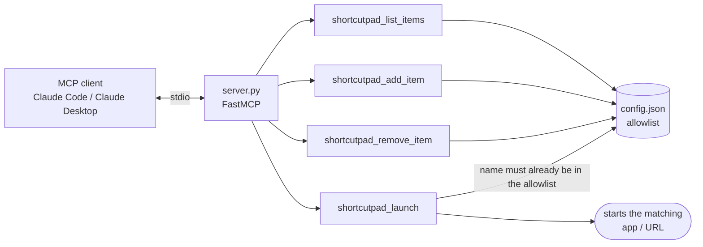

# shortcut-pad-mcp

[](https://github.com/darkspaz-v1/shortcut-pad-mcp/actions/workflows/ci.yml)

MCP server over a Windows launcher config — list and launch local apps by name, allowlist-enforced.

## Install

Requires Python 3.11 or newer (verified on 3.13).

```
git clone https://github.com/darkspaz-v1/shortcut-pad-mcp.git
cd shortcut-pad-mcp
python -m venv .venv
.venv\Scripts\activate
pip install -r requirements.txt
python test_server.py
```

`pip install .` also works and installs the same two dependencies (`mcp`, `pydantic`). The server is
started by your MCP client, not by hand; see [Register it](#register-it) below.

For linting (`ruff check .`, as CI does), use `pip install -r requirements-dev.txt` instead.

## Configuration

| Environment variable | Meaning | Default |
|---|---|---|
| `SHORTCUTPAD_CONFIG_FILE` | Path to the Shortcut Pad launcher's `config.json` (the allowlist of items). | `~/Desktop/Claude/launcher/config.json` |

Set the variable in your MCP client config (below); the default is only a convenience fallback.

## Tools

| Tool | Does |
|---|---|
| `shortcutpad_list_items` | Every configured entry |
| `shortcutpad_launch` | Start one **by name** |
| `shortcutpad_add_item` | Add an entry |
| `shortcutpad_remove_item` | Remove one |

## Architecture



## The design decision worth stating

**The launch tool takes a name, never a path or a command line.** It resolves that name against the
existing `config.json` and refuses anything not already there. An MCP tool that accepted an arbitrary
command would be a remote shell wearing a launcher costume — the allowlist is the entire security
model, so it is enforced at the only entry point rather than validated afterwards.

## Notes

- Tests use a **temporary config** and never start a real program: the launch path is exercised
  through its resolution and validation logic only.
- Removing a non-existent item is an error, not a silent no-op, so a typo surfaces immediately.

**16 checks pass.**

## About MCP

[Model Context Protocol](https://modelcontextprotocol.io) is a standard for exposing tools to an LLM
client. This server speaks MCP over stdio, so it is registered in the client config rather than run
directly.

### Register it

Claude Desktop reads `%APPDATA%\Claude\claude_desktop_config.json`:

```json
{
  "mcpServers": {
    "shortcut-pad": {
      "command": "python",
      "args": ["C:/path/to/shortcut-pad-mcp/server.py"],
      "env": { "SHORTCUTPAD_CONFIG_FILE": "C:/path/to/launcher/config.json" }
    }
  }
}
```

Claude Code equivalent:

```
claude mcp add shortcut-pad -e SHORTCUTPAD_CONFIG_FILE=C:/path/to/launcher/config.json -- python C:/path/to/shortcut-pad-mcp/server.py
```

Use the Python from the environment where you ran `pip install -r requirements.txt` (for a venv, the full
path to `.venv\Scripts\python.exe`) as `command`.

**Register it twice if you use both Claude Code and Claude Desktop.** They read separate config files,
and a server registered in one is invisible to the other — this cost real debugging time.

## Tests

```
python test_server.py
```

Drives every tool through the real handlers and prints one `PASS` line per check. No pytest — the
suite is a single script so it runs anywhere with no dev dependencies.

## License

MIT — see [LICENSE](LICENSE).
