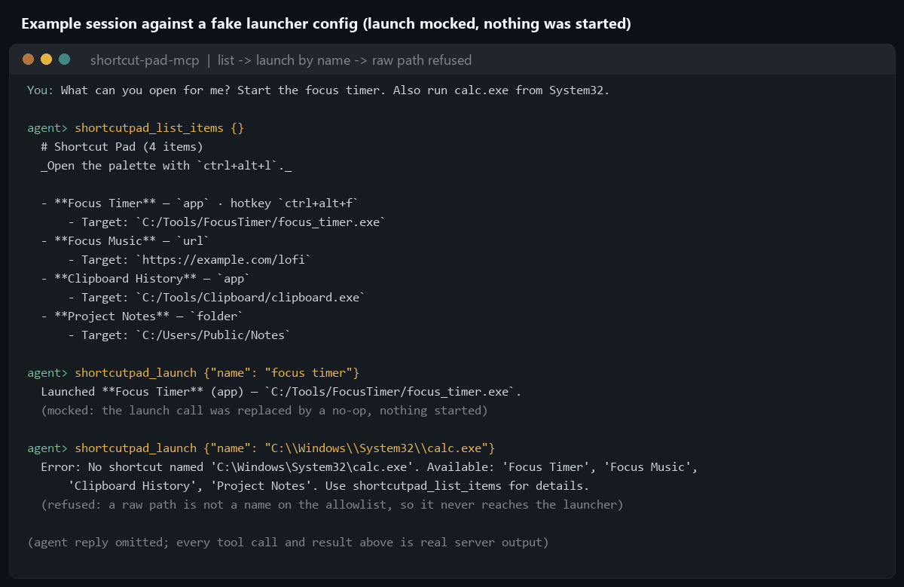

# shortcut-pad-mcp

Let an AI assistant list and launch your Windows apps, folders and links by name, and only the names
already on your Shortcut Pad allowlist.

[](https://github.com/darkspaz-v1/shortcut-pad-mcp/actions/workflows/ci.yml)
[](LICENSE)

[Quick start](#quick-start) · [Tools](#tools) · [How it works](#how-it-works) · [Proof](#proof) · [Limitations](#limitations)



*Example session against a fake config ([`examples/config.sample.json`](examples/config.sample.json)).
Every tool result is real output from `server.py` over MCP, captured by
[`scripts/build_media.py`](scripts/build_media.py). **Nothing was launched:** that script replaces
`os.startfile` and `webbrowser.open` with no-ops and treats the sample's fake paths as existing.*

**How the allowlist is enforced.** `shortcutpad_launch` takes a *name*, never a path or a command line.
Its input schema has exactly one field, `name`. It resolves that name against the launcher's existing
`config.json` and refuses anything not already there, so the check sits at the only entry point rather
than being applied to a command afterwards. An MCP tool that accepted an arbitrary command would be a
remote shell wearing a launcher costume. Read [Limitations](#limitations) for what this does not cover.

## Quick start

Requires Windows, Python 3.11 or newer (verified on 3.13), an MCP client such as Claude Code or Claude
Desktop, and a Shortcut Pad `config.json` (or use the [sample](examples/config.sample.json) to try it;
its fake app and folder paths report "no longer exists" on launch, the intended safe failure, but its URL entry would really open https://example.com).

```
git clone https://github.com/darkspaz-v1/shortcut-pad-mcp.git
cd shortcut-pad-mcp
python -m venv .venv
.venv\Scripts\activate
pip install -r requirements.txt
python test_server.py
```

**Claude Code:**

```
claude mcp add shortcut-pad -e SHORTCUTPAD_CONFIG_FILE=C:/path/to/launcher/config.json -- C:/path/to/shortcut-pad-mcp/.venv/Scripts/python.exe C:/path/to/shortcut-pad-mcp/server.py
```

**Claude Desktop**, in `%APPDATA%\Claude\claude_desktop_config.json`:

```json
{
  "mcpServers": {
    "shortcut-pad": {
      "command": "C:/path/to/shortcut-pad-mcp/.venv/Scripts/python.exe",
      "args": ["C:/path/to/shortcut-pad-mcp/server.py"],
      "env": { "SHORTCUTPAD_CONFIG_FILE": "C:/path/to/launcher/config.json" }
    }
  }
}
```

Use the Python from the environment where you ran `pip install`. Claude Code and Claude Desktop read
separate config files, so register the server in each client you use.

| Environment variable | Meaning | Default |
|---|---|---|
| `SHORTCUTPAD_CONFIG_FILE` | Path to the Shortcut Pad launcher's `config.json` (the allowlist of items). | `~/Desktop/Claude/launcher/config.json` |

Then ask: "What's on my shortcut pad?" followed by "Open the focus timer."

## Tools

| Tool | Does |
|---|---|
| `shortcutpad_list_items` | Every configured entry, with type, target and optional hotkey |
| `shortcutpad_launch` | Start one **by name** (case-insensitive; a partial name works when unambiguous) |
| `shortcutpad_add_item` | Add an entry; app and folder targets must already exist on disk |
| `shortcutpad_remove_item` | Remove an entry (marked destructive); the target program is never deleted |

`shortcutpad_launch` is annotated as open-world (it starts things outside the server) and
`shortcutpad_remove_item` as destructive, so MCP clients that honour annotations can ask you first.

## How it works


- **The launcher's own `config.json` is the allowlist and the only copy of state.** This server is a
  view onto the existing Shortcut Pad app, not a second store. Edits show up in its palette after a
  restart of the launcher.
- **Name matching is progressively looser but never guesses.** Exact (case-insensitive), then prefix,
  then substring. If more than one item matches, nothing launches and the candidates are returned.
- **Adding then launching is a deliberate two-call sequence**, so each step surfaces to you separately.
- **Stale entries fail safe.** If a target no longer exists, launch reports it and suggests removing
  the entry instead of raising.
- Writes go to a temp file that is swapped into place, under an in-process lock.

## Proof

- `python test_server.py` runs 21 checks through the real tool handlers against a temporary config. It
  never starts a program: the launch path is exercised through name resolution and validation, and the
  one successful-launch check replaces `os.startfile` with a recorder. It asserts that a raw path passed
  as a name is refused, that launch's input has only a `name` field, and that exactly four tools exist.
- [CI](.github/workflows/ci.yml) runs `ruff check .` and the test script on Windows for Python 3.12 and 3.13.
- The demo image comes from a real stdio session, with the launch primitives mocked as described above.
- Removing a non-existent item is an error, not a silent no-op, so a typo surfaces immediately.

## Limitations

- **The allowlist is only as strong as who can edit it.** `shortcutpad_add_item` extends the allowlist
  with any existing file or folder path, and `shortcutpad_launch` can then start it. An assistant that
  was manipulated could chain the two calls. The defence is that they are separate tool calls; keep
  per-call approval on in your MCP client, and review what `add_item` is asked to add.
- URL entries are passed to the default browser as given, without checking the scheme.
- Windows only: launching uses `os.startfile`.
- Item hotkeys are stored, but this server does not register them; that is the launcher app's job.
- Tests never start a real program, so real-launch behaviour is verified only by inspection.

## Development and license

Before changing code, run `python test_server.py` and `ruff check .`. To rebuild the README images:
`pip install pillow`, then `python scripts/build_media.py`.

MIT. See [LICENSE](LICENSE). Built on the [Model Context Protocol](https://modelcontextprotocol.io).
